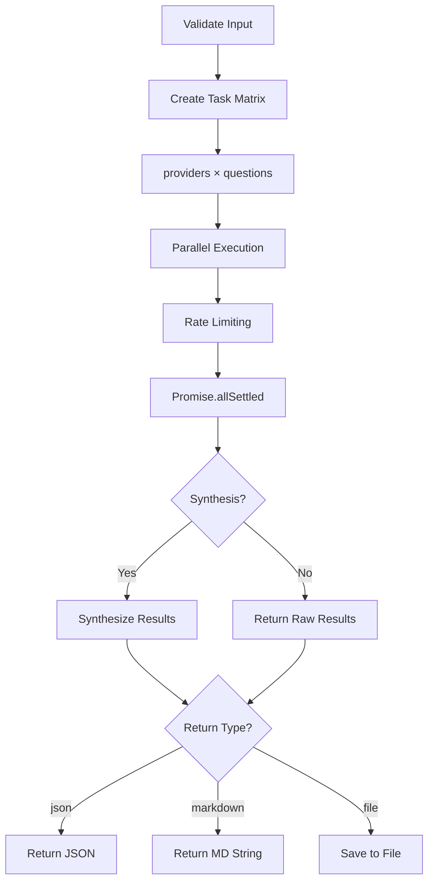
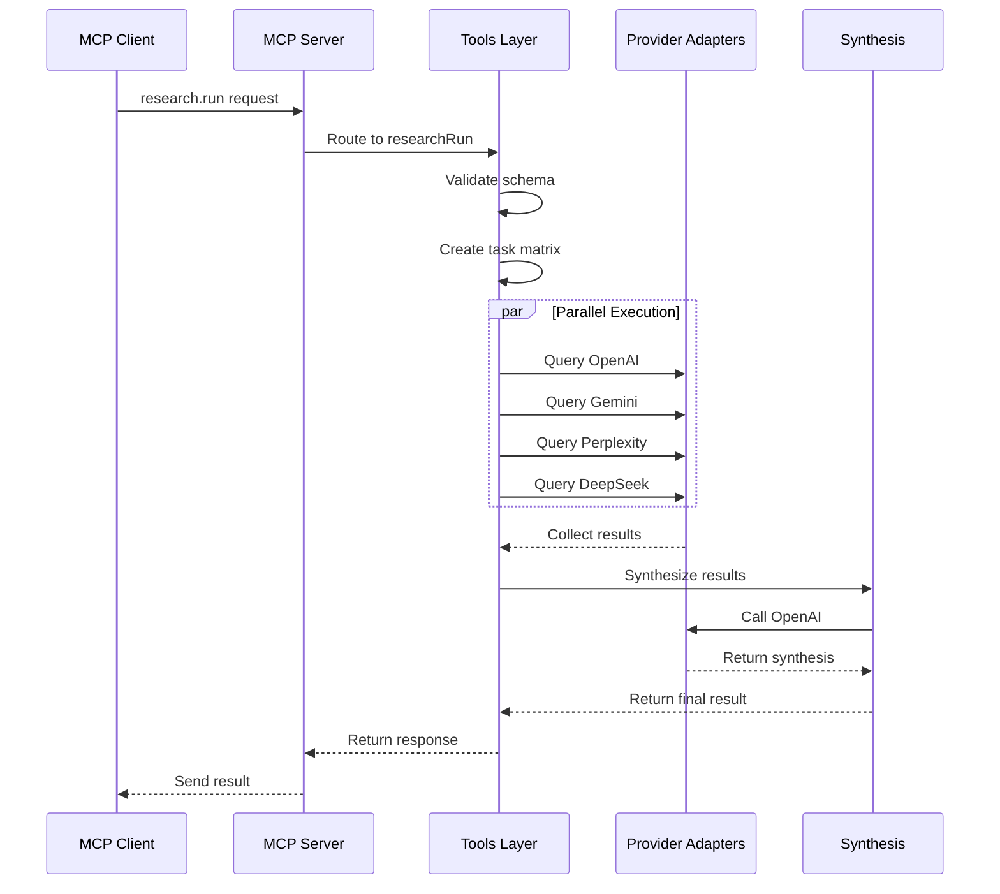

# MCP Research Router - Architecture & Technical Specification

## Project Configuration

### Confirmed Decisions
- **Package Manager**: npm
- **Synthesis Provider**: OpenAI (GPT-5-mini)
- **Rate Limiting**: 2 requests/second per provider, global limit of 6 concurrent
- **Cost Estimation**: Estimated rates per provider (not token-based)
- **Optional Features**: Excluded for initial release (caching, advanced synthesis, resource discovery)

---

## Technical Stack

### Core Dependencies
```json
{
  "@modelcontextprotocol/sdk": "^1.0.0",
  "zod": "^3.22.0",
  "bottleneck": "^2.19.5",
  "p-limit": "^5.0.0"
}
```

### Development Dependencies
```json
{
  "typescript": "^5.3.0",
  "@types/node": "^20.10.0",
  "tsx": "^4.7.0"
}
```

---

## Module Architecture

### 1. Core Types ([`src/types.ts`](src/types.ts))

```typescript
// Provider identifiers
type Provider = 'openai' | 'gemini' | 'perplexity' | 'deepseek';

// Research query structure
interface ResearchQuery {
  id: string;
  text: string;
}

// Provider response
interface ProviderResult {
  provider: Provider;
  model: string;
  questionId: string;
  content: string;
  citations?: Citation[];
  usage?: TokenUsage;
  latencyMs: number;
  timestamp: string;
}

// Synthesis result
interface SynthesisResult {
  synthesized: string;
  sources: ProviderResult[];
  metrics: MetricsSummary;
}
```

### 2. Utility Modules

#### [`src/utils/http.ts`](src/utils/http.ts)
- Fetch wrapper with retry logic
- Exponential backoff (250ms-2000ms)
- Configurable timeout
- Error handling and logging

#### [`src/utils/rateLimit.ts`](src/utils/rateLimit.ts)
- Bottleneck instance per provider (2 req/sec)
- Global p-limit instance (6 concurrent)
- Queue management and metrics

#### [`src/utils/cost.ts`](src/utils/cost.ts)
- Estimated cost per provider/model
- Format: `{ provider: string, estimatedUSD: number }`
- Based on typical query sizes (not actual tokens)

**Cost Estimates:**
```typescript
const COST_ESTIMATES = {
  openai: {
    'gpt-5': 0.015,        // $1.25 input + $10 output per 1M tokens (avg ~1.5K tokens)
    'gpt-5-mini': 0.003,   // $0.25 input + ~$2 output per 1M tokens
    'gpt-5-nano': 0.0006,  // $0.05 input per 1M tokens
    'gpt-4': 0.03,
    'gpt-3.5-turbo': 0.002
  },
  gemini: { 'gemini-2.5-flash': 0.0001, 'gemini-2.5-pro': 0.005 },
  perplexity: { 'sonar-pro': 0.04, 'sonar': 0.01 },
  deepseek: { 'deepseek-chat': 0.001 }
};
```

#### [`src/utils/md.ts`](src/utils/md.ts)
- YAML front matter generation
- Markdown formatting
- File writing to `reports/` directory
- Filename: `research-{timestamp}.md`

#### [`src/utils/log.ts`](src/utils/log.ts)
- JSONL logging to stderr
- Rotating log files in `logs/` directory
- Event types: `provider_started`, `provider_finished`, `synthesis_started`, etc.

### 3. Provider Adapters

All adapters implement a common interface:

```typescript
interface ProviderAdapter {
  query(question: string, model: string): Promise<ProviderResult>;
  listModels(): string[];
  validateConfig(): boolean;
}
```

#### [`src/adapters/openai.ts`](src/adapters/openai.ts)
- Endpoint: `https://api.openai.com/v1/chat/completions`
- Models: `gpt-5`, `gpt-5-mini`, `gpt-5-nano`, `gpt-4`, `gpt-3.5-turbo`
- Auth: `Authorization: Bearer ${OPENAI_API_KEY}`
- Default synthesis model: `gpt-5-mini`

#### [`src/adapters/gemini.ts`](src/adapters/gemini.ts)
- Endpoint: `https://generativelanguage.googleapis.com/v1/models/{model}:generateContent`
- Models: `gemini-2.5-flash`, `gemini-2.5-pro`
- Auth: API key as query parameter

#### [`src/adapters/perplexity.ts`](src/adapters/perplexity.ts)
- Endpoint: `https://api.perplexity.ai/chat/completions`
- Models: `sonar-pro`, `sonar`
- Auth: `Authorization: Bearer ${PERPLEXITY_API_KEY}`
- **Special**: Returns citations array

#### [`src/adapters/deepseek.ts`](src/adapters/deepseek.ts)
- Endpoint: `https://api.deepseek.com/v1/chat/completions`
- Models: `deepseek-chat`
- Auth: `Authorization: Bearer ${DEEPSEEK_API_KEY}`

### 4. Synthesis Module

#### [`src/synth/synthesize.ts`](src/synth/synthesize.ts)
```typescript
async function synthesize(
  results: ProviderResult[],
  synthModel: string = 'gpt-5-mini'
): Promise<SynthesisResult>
```

**Process:**
1. Group results by question ID
2. Extract content from all providers
3. Send to OpenAI with prompt:
   - "Synthesize the following research results"
   - "Remove duplicates"
   - "Highlight contradictions"
   - "Preserve citations"
4. Return synthesized content + metadata

### 5. MCP Tools

#### [`src/tools/researchRun.ts`](src/tools/researchRun.ts)
**Input Schema:**
```json
{
  "providers": ["openai", "gemini", "perplexity", "deepseek"],
  "questions": [
    { "id": "q1", "text": "What is...?" }
  ],
  "synthesis": true,
  "synthModel": "gpt-5-mini",
  "return": "json" | "markdown" | "file",
  "timeoutMs": 30000
}
```

**Process Flow:**


#### [`src/tools/researchStatus.ts`](src/tools/researchStatus.ts)
Returns metrics for last execution:
- Total queries executed
- Success/failure rate per provider
- Average latency per provider
- Total estimated cost

#### [`src/tools/researchModels.ts`](src/tools/researchModels.ts)
Returns cached list of available models per provider

#### [`src/tools/researchSave.ts`](src/tools/researchSave.ts)
Forces saving of last synthesis result to Markdown file

### 6. MCP Server

#### [`src/server.ts`](src/server.ts)
- Initialize MCP server with STDIO transport
- Register all tools with schemas
- Handle tool execution routing
- Emit MCP notifications for events

#### [`src/cli.ts`](src/cli.ts)
- Entry point for binary execution
- Starts MCP server
- Handles shutdown gracefully

---

## Data Flow Diagram



---

## File Structure Implementation

```
mcp-research-router/
├── src/
│   ├── cli.ts                    # Entry point (200 lines)
│   ├── server.ts                 # MCP bootstrap (300 lines)
│   ├── types.ts                  # Type definitions (150 lines)
│   ├── version.ts                # Version constant (5 lines)
│   ├── tools/
│   │   ├── researchRun.ts        # Main tool (400 lines)
│   │   ├── researchStatus.ts     # Status tracking (100 lines)
│   │   ├── researchModels.ts     # Model listing (80 lines)
│   │   └── researchSave.ts       # File saver (120 lines)
│   ├── adapters/
│   │   ├── openai.ts             # OpenAI connector (200 lines)
│   │   ├── gemini.ts             # Gemini connector (220 lines)
│   │   ├── perplexity.ts         # Perplexity connector (200 lines)
│   │   └── deepseek.ts           # DeepSeek connector (180 lines)
│   ├── synth/
│   │   └── synthesize.ts         # Synthesis logic (250 lines)
│   ├── utils/
│   │   ├── http.ts               # Fetch wrapper (150 lines)
│   │   ├── rateLimit.ts          # Rate limiting (120 lines)
│   │   ├── cost.ts               # Cost estimation (80 lines)
│   │   ├── md.ts                 # Markdown writer (150 lines)
│   │   └── log.ts                # Logging (120 lines)
│   └── schema/
│       └── research.run.json     # JSON Schema (100 lines)
├── reports/                      # Generated reports
├── logs/                         # Log files
├── .env.example                  # Environment template
├── .gitignore                    # Ignore rules
├── package.json                  # NPM manifest
├── tsconfig.json                 # TS config
├── README.md                     # User docs
└── LICENSE                       # MIT license
```

**Total Estimated LOC**: ~3,000 lines

---

## Key Implementation Notes

### Error Handling
- All adapter calls wrapped in try-catch
- Failed providers don't block others
- Partial results acceptable
- Clear error messages in logs

### Rate Limiting Strategy
```typescript
// Global limiter
const globalLimit = pLimit(6);

// Per-provider limiter
const providerLimiters = {
  openai: new Bottleneck({ minTime: 500 }), // 2/sec
  gemini: new Bottleneck({ minTime: 500 }),
  perplexity: new Bottleneck({ minTime: 500 }),
  deepseek: new Bottleneck({ minTime: 500 })
};
```

### Synthesis Prompt Template
```
You are a research synthesizer. Analyze the following results from multiple AI providers:

{results}

Tasks:
1. Combine key findings
2. Remove duplicate information
3. Highlight any contradictions
4. Preserve all citations
5. Maintain factual accuracy

Format: Clear, structured summary with citations.
```

### Environment Validation
On startup, check for required API keys:
- Log warning if key missing
- Disable provider if no key
- Continue with available providers

---

## Build & Deployment

### package.json Scripts
```json
{
  "scripts": {
    "build": "tsc",
    "dev": "tsx src/cli.ts",
    "prepublishOnly": "npm run build"
  },
  "bin": {
    "mcp-research-router": "./dist/cli.js"
  }
}
```

### TypeScript Configuration
- Target: ES2022
- Module: NodeNext
- Output: `dist/`
- Declaration files: Yes
- Source maps: Yes

---

## Testing Strategy

### Manual Testing with MCP Inspector
1. Start server: `node dist/cli.js`
2. Connect MCP Inspector
3. Test each tool individually
4. Verify schemas render correctly
5. Check output formats

### Provider Testing
- Create test queries for each provider
- Verify response parsing
- Test error scenarios
- Validate rate limiting

---

## Next Steps for Implementation

The todo list tracks 15 concrete implementation tasks, executed in dependency order:

1. **Foundation** (tasks 2-3): Basic project setup
2. **Utilities** (task 5): Reusable helpers
3. **Adapters** (task 6): Provider integrations
4. **Synthesis** (task 7): Result aggregation
5. **Tools** (task 8): MCP tool layer
6. **Server** (tasks 10-11): MCP bootstrap
7. **Polish** (tasks 12-15): Build config, docs, cleanup

Each task is independent and can be implemented in a single session.

---

## Success Criteria

✅ All four providers functional
✅ Parallel execution working
✅ Synthesis producing quality output
✅ Markdown reports generated correctly
✅ MCP tools discoverable in clients
✅ Rate limiting preventing API throttling
✅ Error handling graceful
✅ Documentation complete
✅ Published to npm successfully
